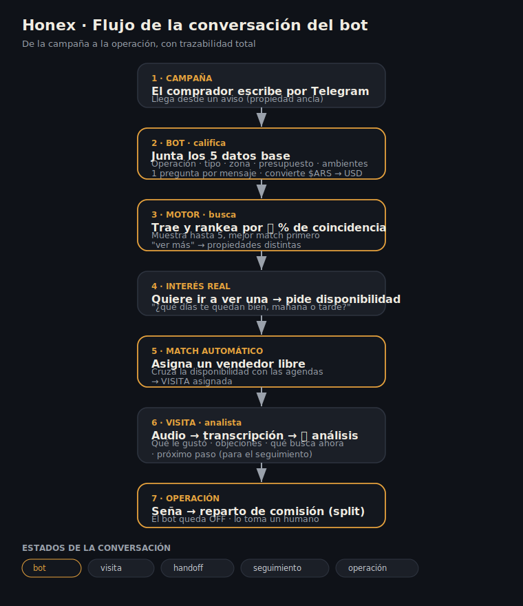

# Honex — Manual de uso

Honex es el panel interno (back-office) de una inmobiliaria. Un comprador escribe
por chat desde una campaña, un **bot** lo atiende y califica, el **motor de búsqueda**
(Tokko) le trae propiedades rankeadas por match, se coordina la **visita** con un
vendedor disponible, y todo el proceso queda registrado hasta la **operación** (con
su reparto de comisión). Es **multi-inmobiliaria**: cada inmobiliaria ve solo su data.

> Canal actual: **Telegram**. El panel es **mobile-first** (operador y vendedor lo usan del celular).

---

## 1. Cómo contesta el bot

El bot es un asistente con IA (Claude o Gemini) que atiende cada conversación. Habla
en **tuteo rioplatense, mensajes cortos y cálidos, con algún emoji**, y hace **una sola
pregunta por mensaje** para no abrumar.

### a) Califica antes de buscar
Antes de mostrar propiedades, junta los **5 datos base**:
1. **Operación** — venta o alquiler
2. **Tipo** — casa, departamento, PH, terreno, local…
3. **Zona o ciudad**
4. **Presupuesto** (o rango)
5. **Ambientes / dormitorios**

Si el comprador da muy pocos datos ("una casa"), **no busca todavía**: pide lo que falta,
priorizando presupuesto y ambientes (que son los que más afinan). Cuando tiene los 5,
pregunta **una vez** si hay alguna preferencia (cochera, a estrenar, balcón, patio,
baños…). Si dice que no, busca igual.

### b) Maneja pesos y dólares solo
El buscador trabaja en **USD**. Si el comprador da el presupuesto en **pesos**, el bot
lo **convierte a dólares** (al dólar oficial del día) automáticamente antes de buscar.
Ejemplo: "hasta 200 millones de pesos" → lo pasa a USD solo.

### c) Busca y muestra con % de coincidencia
Cuando tiene el panorama, consulta el motor y muestra **hasta 5 propiedades ordenadas
de mejor a peor match**, cada una con su **🎯 % de coincidencia** con lo pedido (precio,
ambientes, tipo, zona y preferencias). Si el comprador pide ver más u otras, trae
**propiedades distintas** a las ya mostradas.

### d) Coordina la visita (el handoff principal)
Cuando el comprador muestra **interés real** en una propiedad (quiere ir a verla):
1. El bot **pregunta su disponibilidad** ("¿qué días te quedan bien, mañana o tarde?").
2. Con eso, el sistema **matchea automáticamente un vendedor libre** para ese horario
   (según las agendas) y se lo **asigna**, sin que el bot tenga que preguntar nombres.
3. Si el comprador pide un vendedor puntual por su nombre, se respeta ese.

### e) Estados de la conversación
Cada chat tiene un estado que define quién maneja:

| Estado | Qué significa |
|---|---|
| **bot** | El bot maneja solo; el humano no escribe hasta "tomarla". |
| **visita** | El comprador quiere coordinar visita → se avisa al vendedor y se asigna. |
| **handoff** | Algo se complicó (pregunta "¿sos un bot?", o baja confianza) → toma un humano. |
| **seguimiento** | Post-visita: seguimiento personalizado. |
| **operación** | Avanza la seña → pasa a un humano (otro número), el bot queda OFF. |

### f) Si la IA está saturada
Si el proveedor de IA falla (sin cupo / sobrecargado), el bot responde
*"Uy, estoy con mucha demanda en este momento 🙏 Dame unos segundos y escribime de nuevo"*
y **no guarda ese mensaje** (para no ensuciar el hilo). El comprador reintenta y sigue.

### Diagrama del flujo de conversación



---

## 2. Las secciones del panel

El menú lateral tiene estas secciones (las últimas dependen del rol):

| Sección | Para qué sirve |
|---|---|
| **Dashboard** | KPIs del negocio, embudo, demanda por hora, estado de las piezas (bot / motor / analista). |
| **Chats** | Todas las conversaciones en vivo. Ver el hilo, **tomar** la charla, **corregir** el último mensaje del bot, **reactivar** el bot, **marcar leído** y **derivar a un vendedor**. En celular funciona estilo WhatsApp (lista ↔ chat, e info del cliente al tocar el encabezado). |
| **Acciones** | Cosas que requieren intervención humana (handoffs, pendientes). |
| **Búsquedas** | Historial de búsquedas hechas por el bot, con los criterios y la propiedad-ancla que originó cada lead. |
| **Leads** | Los compradores: estado, score, origen (qué aviso lo trajo), asignación. |
| **Anclas + ADS** | Las propiedades-ancla de las campañas y su trazabilidad (qué aviso trajo cada lead). |
| **Visitas** | Visitas coordinadas. Se puede **subir/grabar el audio** de la visita, **transcribirlo automático**, y correr el **🧠 Analista** que saca de la charla: qué le gustó, objeciones, qué busca ahora y el próximo paso (para el seguimiento). |
| **Agenda** | Disponibilidad de los vendedores (solo agentes de visitas): grilla de 7 días × mañana/tarde. El bot la usa para el match de visitas. |
| **Operaciones** | Registro de operaciones cerradas con su **monto, comisión y reparto (split)** entre inmobiliarias. |
| **Sistema** | Estado de las 3 piezas (orquestador/bot, motor de búsqueda, analista) con métricas reales. |
| **Usuarios** | Usuarios de la inmobiliaria. |
| **Plataforma** *(solo Super Admin)* | Consola del dueño de la plataforma: alta de inmobiliarias y de sus usuarios (email, rol, contraseña y **Telegram ID** del vendedor para Tokko). Solo lo ve el Super Admin. |

### Roles (4 niveles)
- **Super Admin** — dueño de la plataforma (Honex). Da de alta inmobiliarias, ve todo, no pertenece a ninguna inmobiliaria.
- **Administrador** — admin de SU inmobiliaria.
- **Operador** — solo sus leads asignados, dentro de su inmobiliaria.
- **Agente de visitas (vendedor)** — recibe visitas y sube el transcripto.

---

## 3. El recorrido completo (end-to-end)

```
Campaña/aviso
   │  el comprador escribe por Telegram
   ▼
[Bot] califica (5 datos) ──► [Motor] busca y rankea por % match
   │                                   │
   │  muestra hasta 5 propiedades      │
   ▼                                   ▼
El comprador se interesa en una ──► pide disponibilidad
   │
   ▼
[Match automático] vendedor libre para ese día/franja ──► VISITA asignada
   │
   ▼
Visita realizada ──► se sube el audio ──► transcripción ──► 🧠 Analista
   │                                          (le gustó / objeciones / qué busca)
   ▼
Seguimiento personalizado ──► OPERACIÓN (seña) ──► reparto de comisión
```

Todo queda **trazado**: qué aviso trajo el lead, qué se le mostró (registro inmutable),
qué se coordinó y cómo cerró.

---

## 4. Alta de vendedores nuevos (importante)

Los vendedores viven en **dos sistemas** unidos por el **`telegram_id`**:

1. **Front de Tokko Finder** → crea el vendedor (su cuenta e inventario de Tokko) con su `telegram_id`.
2. **Honex → Plataforma** → cargás ese **mismo `telegram_id`** para que el bot lo incluya en la rotación de búsquedas.

> El número de Telegram tiene que ser **el mismo en los dos lados**. Si solo está en
> Tokko Finder, el bot nunca le manda búsquedas (no está en la rotación).
